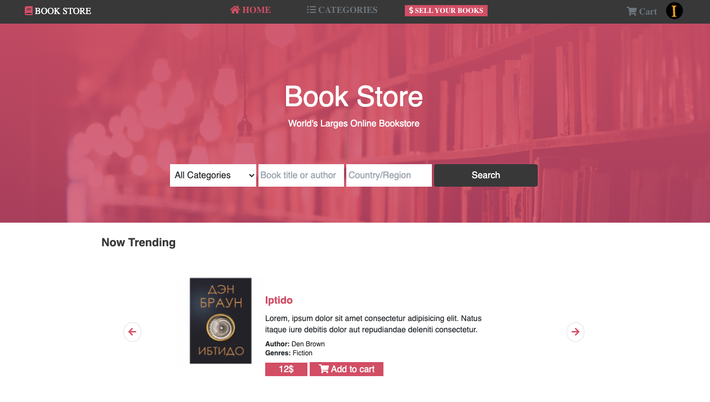
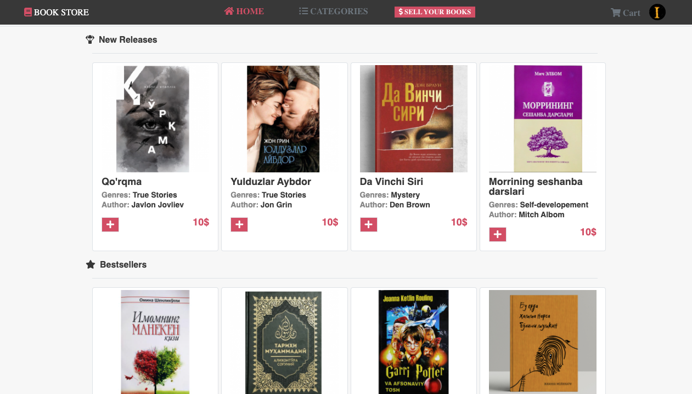
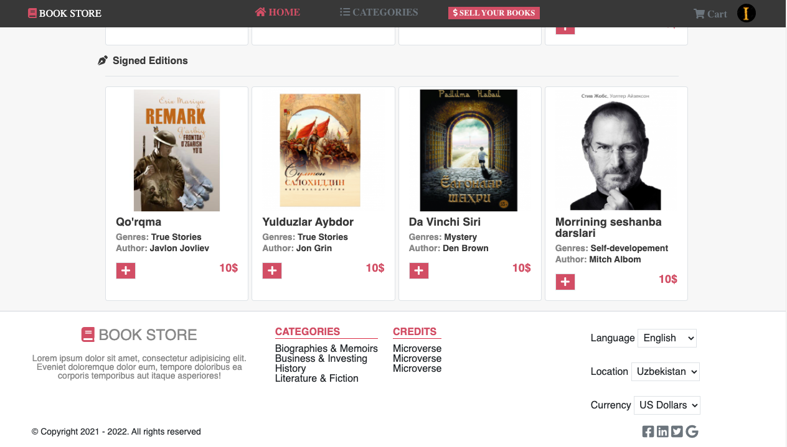
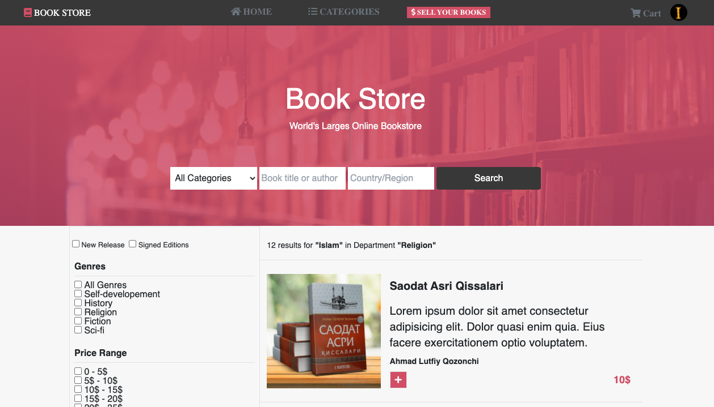
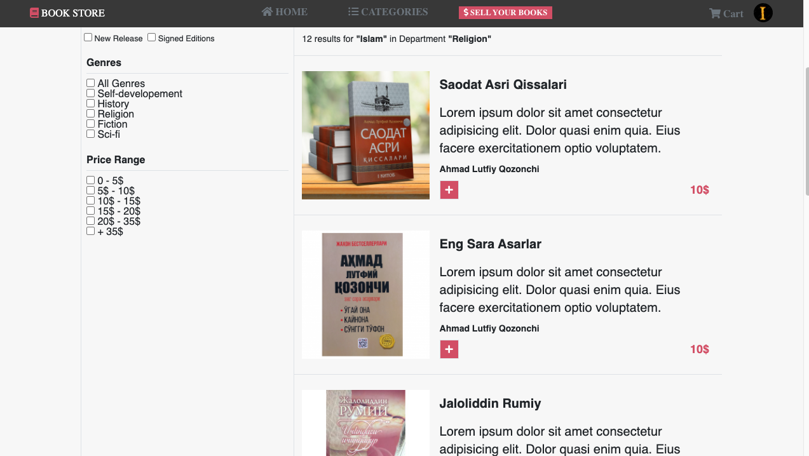

# Capstone Project

> The project I am going to build for the HTML & CSS Capstone Project is based on an online shop for books. 
The webpage looks like <a href="https://www.notion.so/ZATTIX-design-full-view-ed43f6bdfe0144608d4f2fc18758e81a">This sample</a> page.
The website is fully responsive with the help of media query breakpoints and bootstrap. This project has been built with help of modern <button>CSS3</button> and <button>Bootstrap 4</button>.

## Built With

- CSS
- HTML
- Media queries
- Bootstrap
- Visual Studio Code
- Live Server
- Linters

## Live Demo

[Live Demo Link](https://ibrohimrasulov.github.io/book-store/)

## Getting Started
First things to do on the way of cloning this <a href="https://ibrohimrasulov.github.io/book-store/">page</a> are these steps.

• git clone https://github.com/IbrohimRasulov/book-store.git  
• cd book-store  
• git checkout -b capstone  
• git pull origin capstone  
• If you have vscode live-server installed, run it and open localhost:3000

## Authors

👤 **Ibrohim Rasulov**

- [GitHub](https://github.com/IbrohimRasulov)
- [Twitter](https://twitter.com/IbrohimRasu1ov)
- [LinkedIn](https://www.linkedin.com/in/ibrohim-rasulov-a88352209/)

## 🤝 Contributing

Contributions, issues, and feature requests are welcome!

Feel free to check the [issues page](https://github.com/IbrohimRasulov/Newsweek/issues).

## Show your support

Give a ⭐️ if you like this project!

## 📝License

Copyright of Mohammed Awad.

You can use these page freely to improve your knowledge!
You can fork it and use as a basis if you want to build your own page!
If you want to see original page checkout [this](https://www.behance.net/gallery/24796463/ZATTIX).